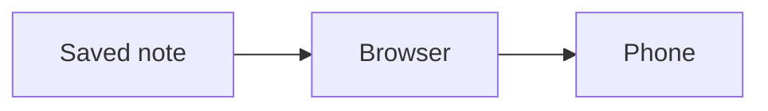

# Preview verification

Saved snapshot: café, 日本語, 🙂. This paragraph is for passage sharing.

## Formatting

**Bold**, *italic*, ~~deleted~~, ==highlighted==, and `inline code`.

- [x] Saved file
- [ ] Unsaved changes must not appear

| Feature | Result |
| --- | --- |
| Unicode | café 日本語 🙂 |
| Links | [Jump to math](#math) |

> [!tip] A useful detail
> Callouts should keep their title and content.

```lua
local message = "hello"
print(message)
```

## Math

Inline math: $x^2 + y^2 = z^2$.

$$\int_0^1 x^2\,dx = \frac{1}{3}$$

## Diagram



## Duplicate

First heading.

## Duplicate

Second heading, with a footnote.[^one]


<script>window.mdwebUnsafe = true</script>

[Unsafe link](javascript:alert(1))

[^one]: Footnotes stay in the document.
